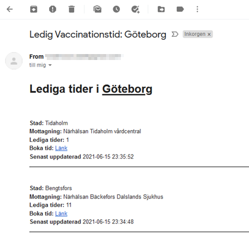

# Covid-Booking-Mailer

Underlättar bokning av vaccin-tid i Västra Götaland. Hämtar lediga vaccinationstider och mailar ut enligt satt
intervall.

## Om

* Hämtar lediga tider för Covid-vaccin från Västra Götalands öppna API.
* Mailar ut lediga tider till valda adresser
* Kontrollerar så att det inte skickas fler mail för samma tid
* Lagrar mottagare och skickade notiser i minnet
* Endpoint för att ta bort och lägga till nya mottagare
    * `GET /recipients/`
    * `POST /recipients/`
        * {
          "email": "user@email.com",
          "municipality": "Göteborg"
          }
    * `DELETE /recipients/`
        * {
          "email": "user@email.com",
          "municipality": "Uddevalla"
          }

## Exempel

Exempel på e-post som skickas ut.



## Inställningar

Nedan miljövariabler krävs. Mer info om hur du får tag i dessa finns under resurser.

```
# API
API_URI= 'Länk till API, hittas bland resurser nedan'
CLIENT_ID= 'Erhålles efter ansökan är godkänd'
CLIENT_SECRET= 'Se ovan'

#E-Post
EMAIL_USERNAME= 'Adress du vill skicka ifrån'
EMAIL_PASSWORD= 'Lösenord till e-post du vill skicka ifrån'
EMAIL_FROM= 'Adress som visas som avsändare'
SMTP_HOST= 'SMTP-Server du använder'
SMTP_PORT= 'Port för ovan'
TRANSPORT_STRATEGY= 'SMTP, SMTP_TLS, etc'
```

## Verktyg

* Spring (WebFlux, Web)
* SimpleJavaMail - https://www.simplejavamail.org

## Resurser

* API: https://eu1.anypoint.mulesoft.com/exchange/portals/vastra-gotalandsregionen/7022b556-013d-4fc9-966c-298db3fc6a46/e-crm-scheduling-public/

* Tips från VGR: https://vgrblogg.se/utveckling/2021/05/27/hjalp-vgr-testa-vart-api-med-oppna-vaccintider/

* Gmail-inställningar: https://www.simplejavamail.org/features.html#section-gmail

* E-post test/sandbox - under utveckling: https://mailtrap.io/

